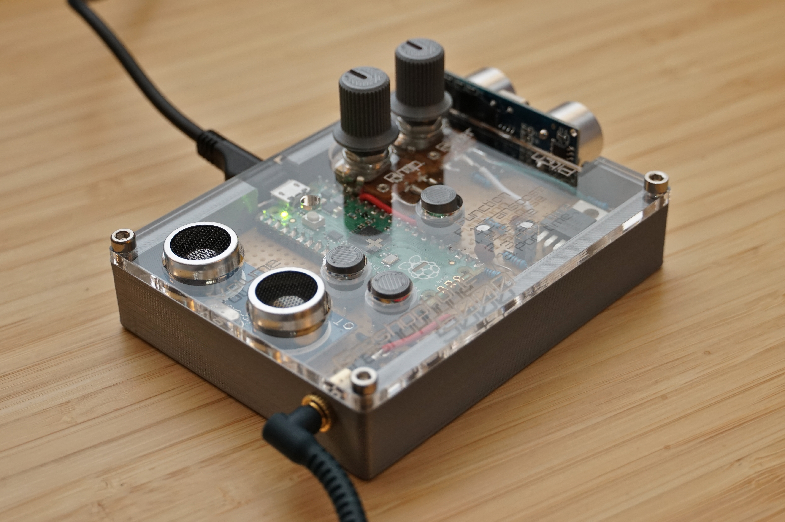

# 🎶 Digital Theremin
A DIY musical instrument inspired by the [theremin](https://en.wikipedia.org/wiki/Theremin), an early analog electronic instrument controlled by proximity of the performer's hands.

This project was originally made as a secret santa gift, with a £10 budget and a 2-week timeframe. This was made possible by not incorporating a power supply or speaker, instead opting for a 'batteries-not-included' design where the user can plug in their own power supply and speaker/headphones.

## 🎛 Features

- Independent volume and pitch control via 2 ultrasounic rangefinder (sonar) sensors
- Automatic quantisation to make playing songs ~actually possible~ easier
- Built-in analog low-pass filter with control knob to adjust brightness of output sound
- Master volume knob
- Transpose and portamento time functions
- Scale function that cycles through a range of scales including chromatic, major, minor, pentatonic and blues

## 🎼 Parts Used

- Raspberry Pi Pico Rev3 (£3.60), running MicroPython 1.18
- 2x HC-SR04 ultrasonic rangefinder modules (£2 each)
- 3.5mm TRS audio jack connector (£0.80)
- 2x 10k linear potentiometers (£0.80 each), one for controlling amplification and the other controlling the low-pass filter.

_... plus a few things I already had, or cost me next-to-nothing:_
- 3D printed housing with laser-cut acrylic lid
- 3D printed potentiometer knobs and button covers
- IRLB8721PbF N-channel power MOSFET
- Veroboard, solder and a few passive components

## 🎧 Setup

Here's how to make one yourself:

1. Solder up the circuit as shown in the [schematic](images/schematic.png)
2. Plug the Pico into a PC. Download the [official MicroPython image](https://www.raspberrypi.com/documentation/microcontrollers/micropython.html#drag-and-drop-micropython) and copy it to the Pico to install.
3. `pip install adafruit-ampy`
4. Download this repo
5. Navigate to src/main and run `ampy put main.py`. Repeat for all files in src/main.
6. Unplug the Pico, plug in a USB power supply (any micro-USB should do just fine) and speakers/headphones (anything with a 3.5mm audio jack will work - turn the volume down the first time you plug it in, just in case), and start playing!
